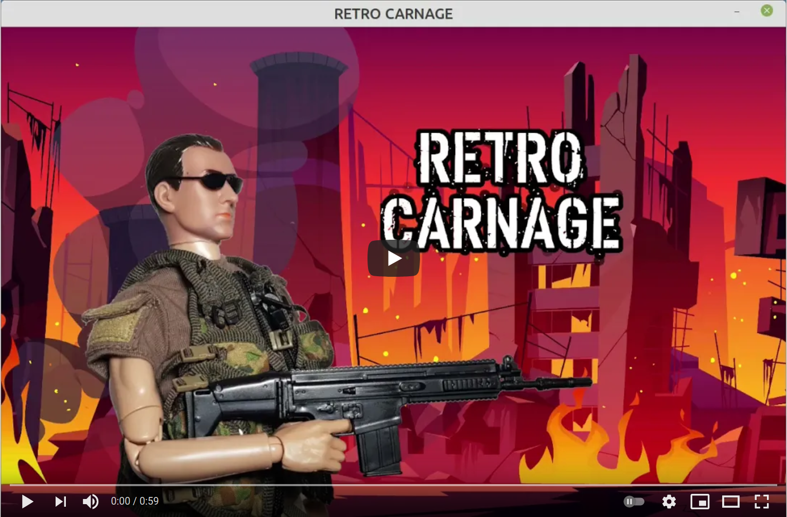

# RETRO CARNAGE

The goal of this project is to take you back to the best part of your childhood. To do this, we are building a modern
multidirectional scrolling shooter. Once finished, Retro-Carnage is going to be a worthy successor of classic video
games like [Ikari Warriors](https://en.wikipedia.org/wiki/Ikari_Warriors) by [SNK](http://www.snk-corp.co.jp/),
[War Zone](https://core-design.com/warzone.html) by [Core Design](https://core-design.com/), or
[Dogs of War](https://en.wikipedia.org/wiki/Dogs_of_War_(1989_video_game))
by [Elite Systems](http://www.elite-systems.co.uk).

This game is currently being developed - but not ready to get played, yet.

Development status as of 2021-08-09

## Build & Run

Make sure you have Golang (>= 1.16) and git installed

### Install dependencies

#### On Ubuntu

Install the required libraries: `sudo apt-get install -y libgl1-mesa-dev xorg-dev libasound2-dev`

#### On Fedora

Install the required
libraries: `sudo dnf install libXcursor-devel libXrandr-devel libXinerama-devel libXi-devel mesa-libGL-devel xorg-x11-server-devel alsa-lib-devel libXxf86vm-devel`

#### On Windows

Install [tdm-gcc](https://jmeubank.github.io/tdm-gcc/) (so that various go-bindings can be compiled).

### Build and run the game

- Get the code: `git clone https://github.com/huddeldaddel/retro-carnage.git`
- Change into the src directory: `cd retro-carnage/src`
- Install required modules: `go get -d`
- Build the application: `go build`
- Move the binary one level up: `mv retro-carnage ./..`
- Change into the main directory: `cd ..`
- Finally: start the game! `./retro-carnage`

The repository contains IDE configurations for JetBrains Goland to test and run the game.
