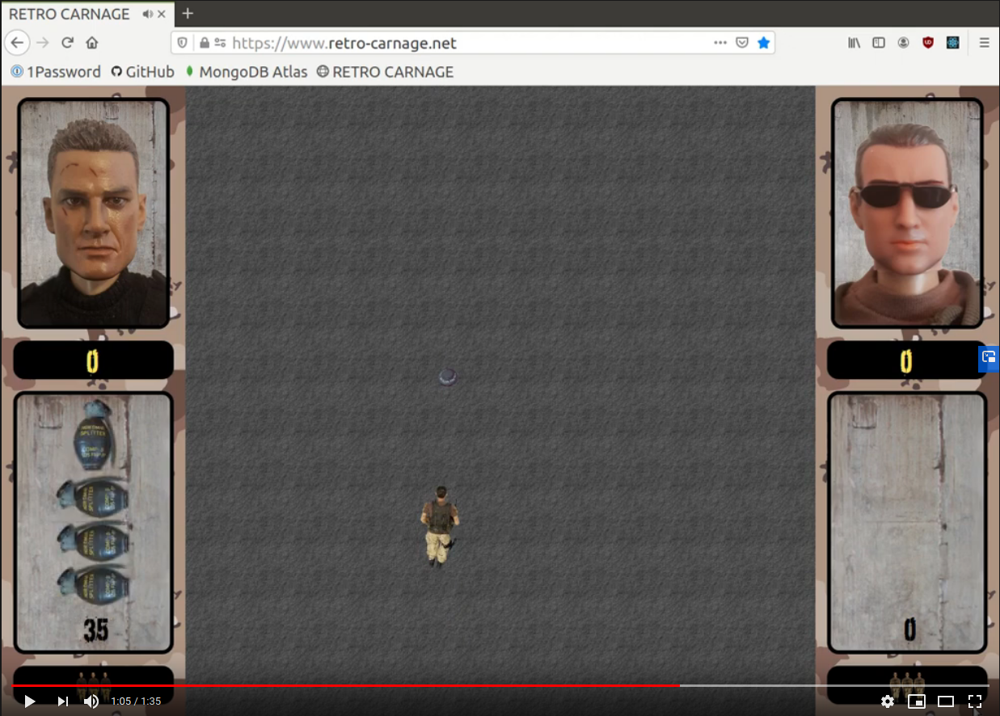

# RETRO CARNAGE

The goal of this project is to build a modern multi-directional scrolling shooter - a worthy successor of the classic
1989 video game [Dogs of War](https://gamesdb.launchbox-app.com/games/details/41090) by
[Elite Systems](http://www.elite-systems.co.uk).

This game is currently under active development. At the moment you can test different concepts of the game but there is
no gripping gameplay.

An unfinished game does not deter you? Then you can find the current state of development on the official homepage of
the game: [http://www.retro-carnage.net](http://www.retro-carnage.net).

Development status 2020-08-25

Development status 2020-04-17

## Build & Run

Retro-Carnage is being developed on Ubuntu Linux (latest). Follow these steps to get the code up & running.  

 - Make sure you have go (>= 1.15) and git installed
 - Install the required development libraries: `sudo apt-get install -y libgl1-mesa-dev xorg-dev libasound2-dev`
 - Get the code: `git clone https://github.com/huddeldaddel/retro-carnage.git`
 - Change into the src directory: `cd retro-carnage.net/src`
 - Install required modules: `go get -d`
 - Build the application: `go build`
 - Run the tests: `go test -v ./...`
 - Move the binary one level up: `mv retro-carnage.net ./..`
 - Change into the main directory: `cd ..`
 - Finally: start the game! `./retro-carnage.net`

## Usage statistics

